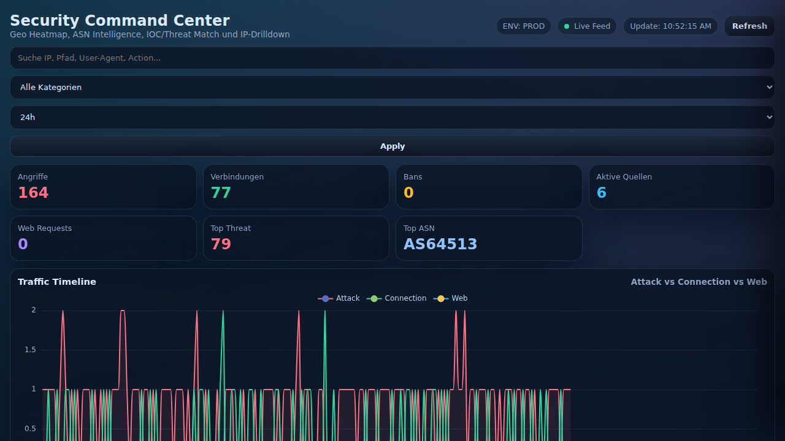
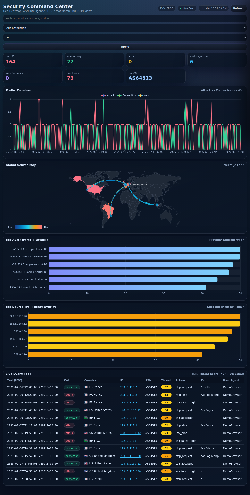

# Security Command Center

Lightweight SOC-style dashboard for Linux server telemetry.

It ingests system and web logs, stores normalized events in SQLite, and serves a live dashboard with:
- Timeline (attack vs. connection vs. web traffic)
- Global source map
- Top ASNs and source IPs
- Live event feed with threat overlays
- IP drilldown with behavior and enrichment context
- Compare mode (current window vs previous window)
- Timeline zoom/brush, stacked mode, and rate normalization
- Source-map Top-N filtering, cluster-aware flow rendering, heat/arcs toggle, and replay mode
- Bidirectional map/table filtering (country + IP scope)

## Screenshots

### Main Dashboard


### Event Feed


## Privacy / Anonymization

This repository is prepared for public sharing:
- hardcoded IOC ranges are anonymized to documentation/test ranges (`198.51.100.0/24`, `203.0.113.0/24`, `192.0.2.0/24`)
- screenshots use seeded demo data only
- runtime DB/log cursor files are gitignored

## Project Structure

- `collector.py`: collects and normalizes logs into SQLite
- `dashboard.py`: Flask UI + API
- `templates/index.html`: dashboard frontend
- `scripts/seed_demo_data.py`: generates anonymized demo data
- `data/`: runtime data (not committed)

## Local Setup

```bash
python3 -m venv .venv
source .venv/bin/activate
pip install -r requirements.txt
python3 scripts/seed_demo_data.py
python3 dashboard.py
```

Open: `http://127.0.0.1:8080`

## Optional Collector Run

```bash
python3 collector.py
```

## Environment Variables

- `SC_DATA_DIR` (default: `./data`)
- `SC_DB_PATH` (default: `./data/security_events.db`)
- `SC_CURSOR_PATH` (default: `./data/journal.cursor`)
- `SC_OFFSETS_PATH` (default: `./data/file_offsets.json`)
- `SC_HOST` (default: `0.0.0.0`)
- `SC_PORT` (default: `8080`)
- `ABUSEIPDB_API_KEY` (optional)
- `MAP_TARGET_NAME` (optional)
- `MAP_TARGET_LAT` (optional)
- `MAP_TARGET_LON` (optional)

## GitHub: New Repository + Push

```bash
cd /root/security-command-center
git init
git add .
git commit -m "Initial public release: anonymized security command center"
git branch -M main
git remote add origin https://github.com/<YOUR_USER>/<YOUR_REPO>.git
git push -u origin main
```

If your account uses 2FA, use a GitHub Personal Access Token (PAT) as password when prompted.
